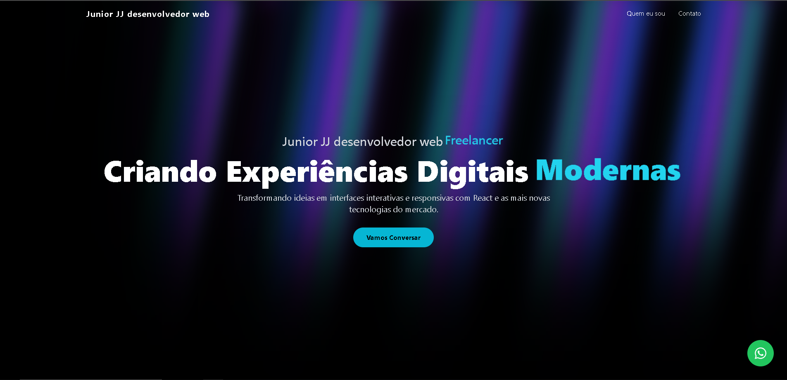

<div align="center">

# Portfolio - Junior JJ



[]()
[]()

</div>

## ✨ Sobre o Projeto

Um website de portfolio pessoal moderno e animado construído com React e Tailwind CSS.

## Características

- UI moderna com animações suaves
- Design responsivo
- Construído com React e TypeScript
- Estilizado com Tailwind CSS

## Começando

### Pré-requisitos

- Node.js

### Instalação

1. Instale as dependências:
   ```bash
   npm install